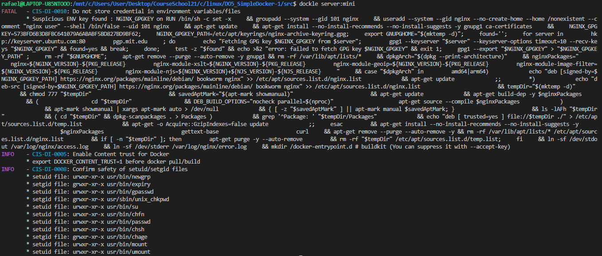

# cd

Введение в докер. Разработка простого докер-образа для собственного сервера.

## Contents

 1. [Задания:](#chapter-iii) \
    1.1. [Готовый докер - nginx](#part-1-готовый-докер) \
    1.2. [Операции с контейнером](#part-2-операции-с-контейнером) \
    1.3. [Мини веб-сервер](#part-3-мини-веб-сервер) \
    1.4. [Свой докер](#part-4-свой-докер) \
    1.5. [Dockle](#part-5-dockle) \
    1.6. [Базовый Docker Compose](#part-6-базовый-docker-compose)

## Part 1. Готовый докер

### **nginx**

**nginx** (произносится как «engine-x») - это обратный прокси-сервер с открытым исходным кодом для протоколов HTTP, HTTPS и т.д.
**nginx** также используется, как балансировщик нагрузки, веб-сервер и для кеширования HTTP.
В проекте **nginx** уделяется особое внимание высокому параллелизму, высокой производительности и низкому использованию памяти.

У **nginx** есть один главный и несколько рабочих процессов.
Основная задача главного процесса — чтение и проверка конфигурации и управление рабочими процессами.
Рабочие процессы выполняют фактическую обработку запросов.

Как работают **nginx** и его модули, определяется в конфигурационном файле. По умолчанию конфигурационный файл называется *nginx.conf*

### Задания выполненны в PowerShell

1. **Выкачивание официального докер-образа с nginx:**

Команда: `docker pull nginx`

2. **Проверка наличия докер-образа:**

Команда: `docker images`

3. **Запуск докер-образа через `docker run -d [image_id|repository]`:**

Команда: `docker run -d nginx`

4. **Проверка, что образ запустился:**

Команда: `docker ps`

5. **Просмотр информации о контейнере через `docker inspect [container_id|container_name]`:**

Команда: `docker inspect d183bc8fe3f5`

- **Размер контейнера:** Не всегда явно указана в выводе docker inspect, для получения размера используйте команду `docker ps -s`.
- **Список замапленных портов:** Смотрите раздел `NetworkSettings.Ports`.
- **IP контейнера:** Смотрите раздел `NetworkSettings.IPAddress`.

**SIZE** \

**PORT** \

**IPAddress** \

6. **Остановка докер-образа через `docker stop [container_id|container_name]`:**

Команда: `docker stop d183bc8fe3f5`

7. **Проверка, что образ остановился:**

Команда: `docker ps`

8. **Запуск докера с портами 80 и 443:**

Команда: `docker run -d -p 80:80 -p 443:443 nginx`

9. **Проверка доступности стартовой страницы nginx по адресу localhost:80:**

**Скриншот браузера http://localhost/**

10. **Перезапуск докер-контейнера через `docker restart [container_id|container_name]`:**

Команда: `docker restart 91e2a5d57f80`

11. **Проверка, что контейнер запустился:**

Команда: `docker ps`

## Part 2. Операции с контейнером

Докер-образ и контейнер готовы. Теперь можно покопаться в конфигурации **nginx** и отобразить статус страницы.

1. **Прочитай конфигурационный файл *nginx.conf* внутри докер контейнера через команду *exec*.**

Команда: `docker exec -it 91e2a5d57f80 cat /etc/nginx/nginx.conf`

2. **Создай на локальной машине файл *nginx.conf*. Настроить в нем пути */status* отдачу страницы статуса сервера *nginx*.**

Модуль <a href="https://nginx.org/ru/docs/http/ngx_http_stub_status_module.html"> ngx_http_stub_status_module</a> предоставляет доступ к базовой информации о состоянии сервера.

    server {
            listen 80;

            location /status {
                stub_status;
            }
        }

**Содержание nginx.conf:**

      user  nginx;
      worker_processes  auto;

      error_log  /var/log/nginx/error.log notice;
      pid        /var/run/nginx.pid;

      events {
              worker_connections  1024;
          }

      http {
          server {
              listen 80;

              location /status {
                  stub_status;
              }
          }
      }

3. **Скопируй созданный файл *nginx.conf* внутрь докер-образа через команду `docker cp`.**

Команда: `docker cp ./nginx.conf 91e2a5d57f80:/etc/nginx/nginx.conf`

4. **Перезапустите **nginx** внутри докер-образа через команду `docker exec`.**

Команда: `docker exec -it 91e2a5d57f80 nginx -s reload`

5. **Проверь, что по адресу *localhost:80/status* отдается страничка со статусом сервера *nginx*.**

**Скриншот браузера http://localhost/status**

6. **Экспортируем контейнер в файл *container.tar* через команду `docker export`.**

Команда: `docker export admiring_dirac > container.tar`

7. **Остановите контейнер.**

Команда: `docker stop 91e2a5d57f80`

8. **Удалим образ через `docker rmi [image_id|repository]`, не удаляя перед этим контейнеры.**

Команда: `docker images`\
Команда: `docker rmi -f dde0cca083bc` *-f Принудительное удаление образа* 

9. **Удали остановленный контейнер.**

Команда: `docker ps -a`  *-a наличие, включая остановленные* \
Команда: `docker rm 91e2a5d57f80`

10. **Импортируй контейнер обратно через команду `docker import`.**

Команда: `docker import container.tar nginx_impoted`

11. **Запусти импортированный контейнер**

Команда: `docker images`\
Команда: `docker run -d -p 80:80 -p 443:443 nginx_impoted:latest nginx -g 'deamon off'`

12. **Проверь, что по адресу *localhost:80/status* отдается страничка со статусом сервера **nginx**.**

**Скриншот браузера http://localhost/status**

## Part 3. Мини веб-сервер

Теперь стоит немного оторваться от докера, чтобы подготовиться к последнему этапу. Время написать свой сервер.

### Задания выполненны в WSL на Ubuntue 

Установите **FastCgi**, если он не установлен. \
Команда: `sudo apt-get install spawn-fcgi libfcgi-dev`

1. **Напиши мини-сервер на *C* и *FastCgi*, который будет возвращать простейшую страничку с надписью `Hello World!`.**

        #include <fcgi_stdio.h>
        #include <stdio.h>

        int main() {
        FCGX_Request request;

        FCGX_Init();
        FCGX_InitRequest(&request, 0, 0);

        while (FCGX_Accept_r(&request) == 0) {
            FCGX_FPrintF(request.out, "Content-Type: text/html\r\n\r\n");
            FCGX_FPrintF(request.out, "<html><head><title>Hello</title></head>");
            FCGX_FPrintF(request.out, "<body><h1>Hello World!</h1></body></html>");
            FCGX_Finish_r(&request);
        }

        return 0;
        }

Скомпилируйте мини-сервер: \
Команда `gcc -o server server.c -lfcgi`

2. **Запусти написанный мини-сервер через *spawn-fcgi* на порту 8080.**

Команда `spawn-fcgi -p 8080 ./server`

3. **Напиши свой *nginx.conf*, который будет проксировать все запросы с 81 порта на *127.0.0.1:8080*.**

        user www-data;
        worker_processes auto;
        pid /run/nginx.pid;
        include /etc/nginx/modules-enabled/*.conf;

        events {
            worker_connections  1024;
        }

        http {
            server {
                listen 81;

                location / {
                    fastcgi_pass 127.0.0.1:8080; 
                    include fastcgi_params;
                }
            }
        }

4. **Проверь, что в браузере по *localhost:81* отдается написанная тобой страничка.**

**Скриншот браузера http://localhost:81**

5. **Положи файл *nginx.conf* по пути *./nginx/nginx.conf* (это понадобится позже).**

Команда `mkdir -p ./nginx` \
Команда `mv nginx.conf ./nginx/nginx.conf`

## Part 4. Свой докер

Теперь всё готово. Можно приступать к написанию докер-образа для созданного сервера.

### **Docker**

Контейнер – новый «исполняемый файл», включающий в себя все необходимые продукту зависимости. \
Главное преимущество контейнеризации – изоляция зависимостей и единая простая точка запуска ПО.

Основные понятия:
- Докер-образ – «упаковка» для приложения и зависимостей (в том числе системных).
- Контейнер – экземпляр образа, то есть «оживший» образ.

**Docker** — это платформа, которая предназначена для разработки, развёртывания и запуска приложений в контейнерах.
**Docker** – «де-факто» стандарт инструмента контейнеризации в индустрии, но он не является первым или последним среди технологий контейнеризации.

Предшественниками контейнеров **Docker** были виртуальные машины.
Виртуальная машина, как и контейнер, изолирует приложение и его зависимости от внешней среды.
Однако контейнеры **Docker** обладают преимуществами перед виртуальными машинами.
Так, они потребляют меньше ресурсов, их очень легко переносить, они быстрее запускаются и приходят в работоспособное состояние.

Докер-образ состоит из слоев. Каждый слой описывает какое-то изменение, которое должно быть выполнено с данными на запущенном контейнере.
Структура связей между слоями — иерархическая. Имеется базовый слой, на который «накладываются» остальные слои.
Для создания образа используется *Dockerfile*. Каждая инструкция в нем создает новый слой.

1. **Создайте файл Dockerfile с следующим содержимым:**

##### 1) собирает исходники мини сервера на FastCgi из [Части 3](#part-3-мини-веб-сервер);
##### 2) запускает его на 8080 порту;
##### 3) копирует внутрь образа написанный *./nginx/nginx.conf*;

        user  nginx;
        worker_processes  auto;

        error_log  /var/log/nginx/error.log notice;
        pid        /var/run/nginx.pid;

        events {
            worker_connections  1024;
        }

        http {
            include       /etc/nginx/mime.types;
            default_type  application/octet-stream;

            server {
                listen 81;

                location / {
                    fastcgi_pass 127.0.0.1:8080;
                    include fastcgi_params;
                }
            }
        }

##### 4) запускает **nginx**.

Dockerfile:

        FROM nginx:alpine
        WORKDIR /home
        COPY /server/server.c /home/
        COPY /nginx/nginx.conf /etc/nginx/
        RUN apk add gcc g++ make spawn-fcgi fcgi-dev
        RUN gcc -o /home/server /home/server.c -lfcgi
        CMD spawn-fcgi -p 8080 /home/server && nginx -g 'daemon off;'

2. **Соберем написанный докер-образ через `docker build` при этом указав имя и тег.**

Команда `docker build -t server:mini .`

3. **Проверим через `docker images`, что все собралось корректно.**

Команда `docker images`

4. **Запусти собранный докер-образ с маппингом 81 порта на 80 на локальной машине и маппингом папки *./nginx* внутрь контейнера по адресу, где лежат конфигурационные файлы **nginx**'.**

Команда `docker run -d -p 80:81 -v C:\Users\User\Desktop\CourseSchool21\c\linux\DO5_SimpleDocker-1\src\nginx\nginx.conf:/etc/nginx/nginx.conf server:mini`

5. **По localhost:80 доступна страничка написанного мини сервера.**

**Скриншот браузера http://localhost:80**

6. **Допишим в *./nginx/nginx.conf* проксирование странички */status*, по которой надо отдавать статус сервера **nginx**.**

        location /status {
            stub_status;
        }

7. **Перезапустим докер-образ.**

Команда `docker restart 9a021a5a6a9e`

8. **Проверим, что теперь по *localhost:80/status* отдается страничка со статусом *nginx***

Скриншот браузера localhost:80/status:

## Part 5. **Dockle**

### **Dockle**

**Dockle** — это инструмент для проверки безопасности образов контейнеров, который можно использовать для поиска уязвимостей.

Основные функции и преимущества **Dockle**:
- поиск уязвимостей в образах;
- помощь в создании правильного Dockerfile;
- простота в использовании, нужно указать только имя образа;
- поддержка *CIS Benchmarks*.

#### Просканирум образ из предыдущего задания через `dockle [image_id|repository]`.
#### Исправим образ так, чтобы при проверке через **dockle** не было ошибок и предупреждений.

### Задания выполненны в wsl, так как dockle не поддерживает Windows, так же можно через образ в docker.

        Unfortunately, dockle doesn't work on Windows. This is because of differences in file systems.
        I will remove windows builds from https://github.com/goodwithtech/dockle/releases.

1. **Установка dockle.**

Команда `brew install goodwithtech/r/dockle`

2. **Cканируем образ.**

Команда `dockle server:mini`

3. **Для решения информационного предупреждения CIS-DI-0008.**

Добаляем в Dockerfile:

    chmod u-s /usr/bin/chfn && \
    chmod g-s /usr/sbin/unix_chkpwd && \
    chmod g-s /usr/bin/expiry && \
    chmod u-s /usr/bin/umount && \
    chmod u-s /usr/bin/su && \
    chmod u-s /usr/bin/passwd && \
    chmod g-s /usr/bin/chage && \
    chmod u-s /usr/bin/chsh && \
    chmod u-s /usr/bin/mount && \
    chmod u-s /usr/bin/newgrp && \
    chmod u-s /usr/bin/gpasswd

4. **Для решения информационного предупреждения CIS-DI-0005.**

Команды: `export DOCKER_CONTENT_TRUST=1` \
    `docker build -t server:mini .`

4. **Для решения FATAL-CIS-DI-0010.**

Команды: `dockle -ak NGINX_GPGKEY -ak NGINX_GPGKEY_PATH server:mini`

Переменные NGINX_GPGKEY и NGINX_GPGKEY_PATH используются в процессе настройки и проверки ключей GPG для пакетов Nginx, установлены в базовом образе nginx:latest.

## Part 6. Базовый **Docker Compose**

### **Docker Compose**

Docker Compose — это инструментальное средство, которое предназначено для решения задач, связанных с развёртыванием проектов.
Docker Compose может пригодиться, если для обеспечения функционирования проекта используется несколько сервисов.

Docker Compose используется для одновременного управления несколькими контейнерами, входящими в состав приложения.
Этот инструмент предлагает те же возможности, что и Docker, но позволяет работать с более сложными распределенными приложениями, например микросервисными.

1. **Напишим файл *docker-compose.yml*, с помощью которого:**
##### 1) Поднимим докер-контейнер из [Части 5](#part-5-инструмент-dockle)
##### 2) Поднимим докер-контейнер с **nginx**, который будет проксировать все запросы с 8080 порта на 81 порт первого контейнера.
##### Замапь 8080 порт второго контейнера на 80 порт локальной машины.

        version: "3.9"

        services:
        server_mini:
            build:
            context: ./server
            container_name: server_mini

        nginxer:
            image: nginx:latest
            container_name: nginxer
            ports:
            - "80:8080"
            volumes:
            - ./nginx/nginx.conf:/etc/nginx/nginx.conf
            depends_on:
            - server_mini

2. **Останови все запущенные контейнеры.**

Команды: `docker ps` и `docker stop CONTAINER_ID`

3. **Собери и запусти проект с помощью команд `docker-compose build` и `docker-compose up`.**

Команда: `docker compose build`

Команда: `docker compose up`

\

4. **Проверим, что в браузере по *localhost:80* отдается написанная тобой страничка, как и ранее.**

Скриншот браузера *localhost:80*:

